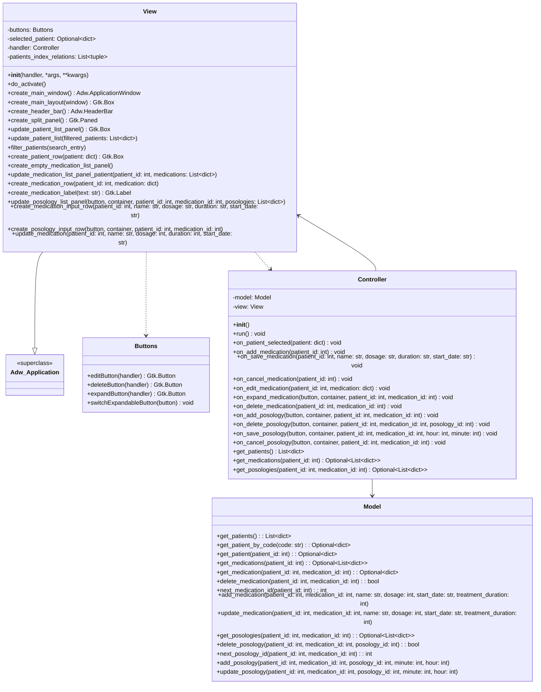

```mermaid
classDiagram
    class Model {
        +get_patients(): List~dict~
        +get_patient_by_code(code: str): Optional~dict~
        +get_patient(patient_id: int): Optional~dict~
        +get_medications(patient_id: int): Optional~List~dict~~
        +get_medication(patient_id: int, medication_id: int): Optional~dict~
        +delete_medication(patient_id: int, medication_id: int): bool
        +next_medication_id(patient_id: int): int
        +add_medication(patient_id: int, medication_id: int, name: str, dosage: int, start_date: str, treatment_duration: int)
        +update_medication(patient_id: int, medication_id: int, name: str, dosage: int, start_date: str, treatment_duration: int)
        +get_posologies(patient_id: int, medication_id: int): Optional~List~dict~~
        +delete_posology(patient_id: int, medication_id: int, posology_id: int): bool
        +next_posology_id(patient_id: int, medication_id: int): int
        +add_posology(patient_id: int, medication_id: int, posology_id: int, minute: int, hour: int)
        +update_posology(patient_id: int, medication_id: int, posology_id: int, minute: int, hour: int)
    }

        %% Definición de la clase View
    class View {
        -buttons: Buttons
        -selected_patient: Optional~dict~
        -handler: Controller
        -patients_index_relations: List~tuple~

        +__init__(handler, *args, **kwargs)
        +do_activate()
        +create_main_window() Adw.ApplicationWindow
        +create_main_layout(window) Gtk.Box
        +create_header_bar() Adw.HeaderBar
        +create_split_panel() Gtk.Paned
        +update_patient_list_panel() Gtk.Box
        +update_patient_list(filtered_patients: List~dict~)
        +filter_patients(search_entry)
        +create_patient_row(patient: dict) Gtk.Box
        +create_empty_medication_list_panel()
        +update_medication_list_panel_patient(patient_id: int, medications: List~dict~)
        +create_medication_row(patient_id: int, medication: dict)
        +create_medication_label(text: str) Gtk.Label
        +update_posology_list_panel(button, container, patient_id: int, medication_id: int, posologies: List~dict~)
        +create_medication_input_row(patient_id: int, name: str, dosage: str, duration: str, start_date: str)
        +create_posology_input_row(button, container, patient_id: int, medication_id: int)
        +update_medication(patient_id: int, name: str, dosage: int, duration: int, start_date: str)
    }

    class Adw_Application {
        <<superclass>>
    }

    class Buttons {
        +editButton(handler) Gtk.Button
        +deleteButton(handler) Gtk.Button
        +expandButton(handler) Gtk.Button
        +switchExpandableButton(button) void
    }

    class Controller {
        -model: Model
        -view: View

        +__init__()
        +run() void
        +on_patient_selected(patient: dict) void
        +on_add_medication(patient_id: int) void
        +on_save_medication(patient_id: int, name: str, dosage: str, duration: str, start_date: str) void
        +on_cancel_medication(patient_id: int) void
        +on_edit_medication(patient_id: int, medication: dict) void
        +on_expand_medication(button, container, patient_id: int, medication_id: int) void
        +on_delete_medication(patient_id: int, medication_id: int) void
        +on_add_posology(button, container, patient_id: int, medication_id: int) void
        +on_delete_posology(button, container, patient_id: int, medication_id: int, posology_id: int) void
        +on_save_posology(button, container, patient_id: int, medication_id: int, hour: int, minute: int) void
        +on_cancel_posology(button, container, patient_id: int, medication_id: int) void
        +get_patients() List~dict~
        +get_medications(patient_id: int) Optional~List~dict~~
        +get_posologies(patient_id: int, medication_id: int) Optional~List~dict~~
    }

    View --|> Adw_Application
    View ..> Buttons
    View ..> Controller
    Controller --> Model
    Controller --> View

```