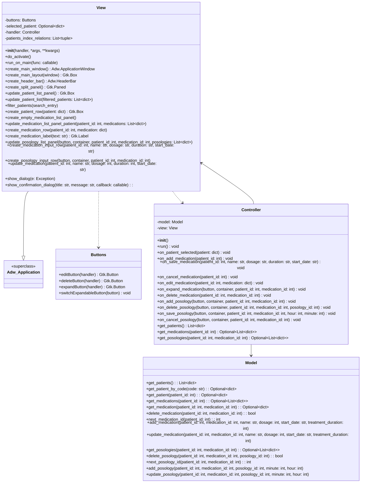
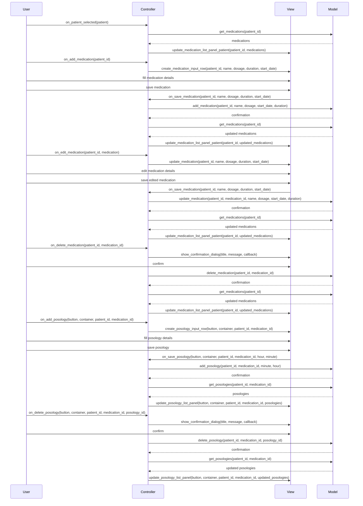

# Diagrama de clases

```mermaid
classDiagram
    class Model {
        +get_patients(): List~dict~
        +get_patient_by_code(code: str): Optional~dict~
        +get_patient(patient_id: int): Optional~dict~
        +get_medications(patient_id: int): Optional~List~dict~~
        +get_medication(patient_id: int, medication_id: int): Optional~dict~
        +delete_medication(patient_id: int, medication_id: int): bool
        +next_medication_id(patient_id: int): int
        +add_medication(patient_id: int, medication_id: int, name: str, dosage: int, start_date: str, treatment_duration: int)
        +update_medication(patient_id: int, medication_id: int, name: str, dosage: int, start_date: str, treatment_duration: int)
        +get_posologies(patient_id: int, medication_id: int): Optional~List~dict~~
        +delete_posology(patient_id: int, medication_id: int, posology_id: int): bool
        +next_posology_id(patient_id: int, medication_id: int): int
        +add_posology(patient_id: int, medication_id: int, posology_id: int, minute: int, hour: int)
        +update_posology(patient_id: int, medication_id: int, posology_id: int, minute: int, hour: int)
    }

        %% Definición de la clase View
    class View {
        -buttons: Buttons
        -selected_patient: Optional~dict~
        -handler: Controller
        -patients_index_relations: List~tuple~

        +__init__(handler, *args, **kwargs)
        +do_activate()
        +run_on_main(func: callable)
        +create_main_window() Adw.ApplicationWindow
        +create_main_layout(window) Gtk.Box
        +create_header_bar() Adw.HeaderBar
        +create_split_panel() Gtk.Paned
        +update_patient_list_panel() Gtk.Box
        +update_patient_list(filtered_patients: List~dict~)
        +filter_patients(search_entry)
        +create_patient_row(patient: dict) Gtk.Box
        +create_empty_medication_list_panel()
        +update_medication_list_panel_patient(patient_id: int, medications: List~dict~)
        +create_medication_row(patient_id: int, medication: dict)
        +create_medication_label(text: str) Gtk.Label
        +update_posology_list_panel(button, container, patient_id: int, medication_id: int, posologies: List~dict~)
        +create_medication_input_row(patient_id: int, name: str, dosage: str, duration: str, start_date: str)
        +create_posology_input_row(button, container, patient_id: int, medication_id: int)
        +update_medication(patient_id: int, name: str, dosage: int, duration: int, start_date: str)
        +show_dialog(e: Exception)
        +show_confirmation_dialog(title: str, message: str, callback: callable):
    }

    class Adw_Application {
        <<superclass>>
    }

    class Buttons {
        +editButton(handler) Gtk.Button
        +deleteButton(handler) Gtk.Button
        +expandButton(handler) Gtk.Button
        +switchExpandableButton(button) void
    }

    class Controller {
        -model: Model
        -view: View

        +__init__()
        +run() void
        +on_patient_selected(patient: dict) void
        +on_add_medication(patient_id: int) void
        +on_save_medication(patient_id: int, name: str, dosage: str, duration: str, start_date: str) void
        +on_cancel_medication(patient_id: int) void
        +on_edit_medication(patient_id: int, medication: dict) void
        +on_expand_medication(button, container, patient_id: int, medication_id: int) void
        +on_delete_medication(patient_id: int, medication_id: int) void
        +on_add_posology(button, container, patient_id: int, medication_id: int) void
        +on_delete_posology(button, container, patient_id: int, medication_id: int, posology_id: int) void
        +on_save_posology(button, container, patient_id: int, medication_id: int, hour: int, minute: int) void
        +on_cancel_posology(button, container, patient_id: int, medication_id: int) void
        +get_patients() List~dict~
        +get_medications(patient_id: int) Optional~List~dict~~
        +get_posologies(patient_id: int, medication_id: int) Optional~List~dict~~
    }

    View --|> Adw_Application
    View ..> Buttons
    View ..> Controller
    Controller --> Model
    Controller --> View

```
# Diagrama de secuencia

```mermaid
sequenceDiagram
    participant User
    participant Controller
    participant View
    participant Model

    User ->> Controller: on_patient_selected(patient)
    Controller ->> Model: get_medications(patient_id)
    Model -->> Controller: medications
    Controller ->> View: update_medication_list_panel_patient(patient_id, medications)

    User ->> Controller: on_add_medication(patient_id)
    Controller ->> View: create_medication_input_row(patient_id, name, dosage, duration, start_date)
    User ->> View: fill medication details
    User ->> View: save medication
    View ->> Controller: on_save_medication(patient_id, name, dosage, duration, start_date)
    Controller ->> Model: add_medication(patient_id, name, dosage, start_date, duration)
    Model -->> Controller: confirmation
    Controller ->> Model: get_medications(patient_id)
    Model -->> Controller: updated medications
    Controller ->> View: update_medication_list_panel_patient(patient_id, updated_medications)

    User ->> Controller: on_edit_medication(patient_id, medication)
    Controller ->> View: update_medication(patient_id, name, dosage, duration, start_date)
    User ->> View: edit medication details
    User ->> View: save edited medication
    View ->> Controller: on_save_medication(patient_id, name, dosage, duration, start_date)
    Controller ->> Model: update_medication(patient_id, medication_id, name, dosage, start_date, duration)
    Model -->> Controller: confirmation
    Controller ->> Model: get_medications(patient_id)
    Model -->> Controller: updated medications
    Controller ->> View: update_medication_list_panel_patient(patient_id, updated_medications)

    User ->> Controller: on_delete_medication(patient_id, medication_id)
    Controller ->> View: show_confirmation_dialog(title, message, callback)
    User ->> View: confirm
    Controller ->> Model: delete_medication(patient_id, medication_id)
    Model -->> Controller: confirmation
    Controller ->> Model: get_medications(patient_id)
    Model -->> Controller: updated medications
    Controller ->> View: update_medication_list_panel_patient(patient_id, updated_medications)

    User ->> Controller: on_add_posology(button, container, patient_id, medication_id)
    Controller ->> View: create_posology_input_row(button, container, patient_id, medication_id)
    User ->> View: fill posology details
    User ->> View: save posology
    View ->> Controller: on_save_posology(button, container, patient_id, medication_id, hour, minute)
    Controller ->> Model: add_posology(patient_id, medication_id, minute, hour)
    Model -->> Controller: confirmation
    Controller ->> Model: get_posologies(patient_id, medication_id)
    Model -->> Controller: posologies
    Controller ->> View: update_posology_list_panel(button, container, patient_id, medication_id, posologies)

    User ->> Controller: on_delete_posology(button, container, patient_id, medication_id, posology_id)
    Controller ->> View: show_confirmation_dialog(title, message, callback)
    User ->> View: confirm
    Controller ->> Model: delete_posology(patient_id, medication_id, posology_id)
    Model -->> Controller: confirmation
    Controller ->> Model: get_posologies(patient_id, medication_id)
    Model -->> Controller: updated posologies
    Controller ->> View: update_posology_list_panel(button, container, patient_id, medication_id, updated_posologies)
```
