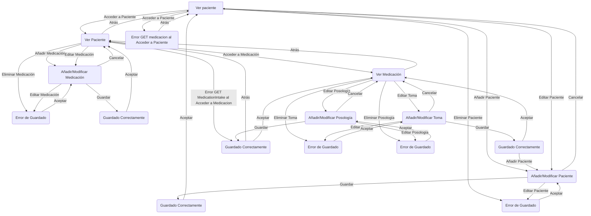
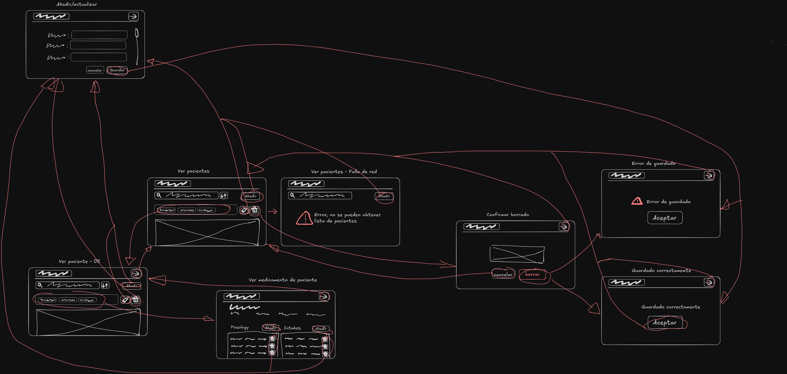

# Diseño Estático

## Complejidad Ciclomática
La complejidad ciclomática del diagrama de flujo sigue la siguiente fórmula: 

E−N+2P

E(Número de aristas) es igual a 39. 
N(Número de nodos) es igual a 21. 
P(Número de componentes conectados) es igual a 1.

Por lo tanto:
39 - 21 + 2 * 1 = 20

## Casos de Prueba para el Sistema de Gestión de Pacientes
### Caso de Prueba 1: Ver Lista de Pacientes
Verificar que el sistema muestre la lista de pacientes.
Verificar que el sistema gestione los errores al obtener los datos de los pacientes.

### Caso de Prueba 2: Añadir Nuevo Paciente
Verificar que el usuario pueda añadir un nuevo paciente correctamente.
Verificar que el sistema muestre un mensaje de error cuando falle el guardado del nuevo paciente.

### Caso de Prueba 3: Editar Paciente
Verificar que el usuario pueda editar un paciente existente correctamente.
Verificar que el sistema gestione los errores al actualizar los datos del paciente.

### Caso de Prueba 4: Eliminar Paciente
Verificar que el usuario pueda eliminar un paciente correctamente.
Verificar que el sistema gestione los errores al eliminar un paciente.

### Caso de Prueba 5: Acceder a Detalles del Paciente
Verificar que el usuario pueda acceder y ver los detalles de un paciente.
Verificar que el sistema gestione los errores al acceder a los detalles de la medicación del paciente.

### Caso de Prueba 6: Añadir Medicación a Paciente
Verificar que el usuario pueda añadir medicación a un paciente correctamente.
Verificar que el sistema muestre un mensaje de error cuando falle el guardado de la medicación.

### Caso de Prueba 7: Editar Medicación
Verificar que el usuario pueda editar la medicación de un paciente correctamente.
Verificar que el sistema gestione los errores al actualizar los detalles de la medicación.

### Caso de Prueba 8: Eliminar Medicación
Verificar que el usuario pueda eliminar la medicación de un paciente correctamente.
Verificar que el sistema gestione los errores al eliminar la medicación.

### Caso de Prueba 9: Ver Detalles de la Medicación
Verificar que el usuario pueda ver los detalles de la medicación.
Verificar que el sistema gestione los errores al acceder a la información de las tomas de medicación.

### Caso de Prueba 10: Añadir Toma de Medicación
Verificar que el usuario pueda añadir una toma de medicación correctamente.
Verificar que el sistema muestre un mensaje de error cuando falle el guardado de la toma.

### Caso de Prueba 11: Editar Toma de Medicación
Verificar que el usuario pueda editar una toma de medicación existente correctamente.
Verificar que el sistema gestione los errores al actualizar la toma de medicación.

### Caso de Prueba 12: Eliminar Toma de Medicación
Verificar que el usuario pueda eliminar una toma de medicación correctamente.
Verificar que el sistema gestione los errores al eliminar una toma de medicación.

### Caso de Prueba 13: Añadir Posología de Medicación
Verificar que el usuario pueda añadir la posología (instrucciones de dosificación) de la medicación correctamente.
Verificar que el sistema muestre un mensaje de error cuando falle el guardado de la posología.

### Caso de Prueba 14: Editar Posología de Medicación
Verificar que el usuario pueda editar la posología de la medicación correctamente.
Verificar que el sistema gestione los errores al actualizar los detalles de la posología.

### Caso de Prueba 15: Eliminar Posología de Medicación
Verificar que el usuario pueda eliminar la posología de la medicación correctamente.
Verificar que el sistema gestione los errores al eliminar la posología.

# Diseño Dinámico

