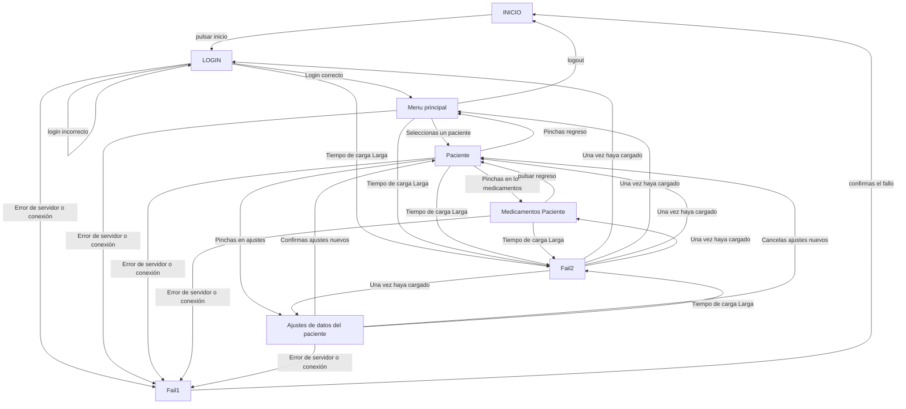

Para el calculo de la complejidad ciclomatica, fue usado una ia según las recomendaciones del Git, a continuación se presentan la pregunta formulada a la ia como la respuesta según como se pide en el readme:

Pregunta introducida:
calcula la complejidad ciclomatica de este codigo en mermaid:     

Respuesta dada por la IA:

Para calcular la complejidad ciclomatica de este código con el diagrama en formato Mermaid, utilizamos la misma fórmula que antes:

\[
V(G) = E - N + 2P
\]

Donde:
- \( E \) es el número de aristas (transiciones).
- \( N \) es el número de nodos.
- \( P \) es el número de componentes conexos (que será 1 en este caso).

### Paso 1: Contar los nodos \( N \)

Identificamos los nodos en el diagrama:

1. A (INICIO)
2. B (LOGIN)
3. C (Menu principal)
4. D (Paciente)
5. E (Medicamentos Paciente)
6. F (Ajustes de datos del paciente)
7. Fail1 (Error de servidor o conexión)
8. Fail2 (Tiempo de carga Larga)

Por lo tanto, \( N = 8 \).

### Paso 2: Contar las aristas \( E \)

Vamos a contar las transiciones entre los nodos (teniendo en cuenta que algunas son múltiples):

1. A → B (pulsar inicio)
2. B → B (login incorrecto)
3. B → C (Login correcto)
4. C → A (logout)
5. C → D (Seleccionas un paciente)
6. D → E (Pinchas en los medicamentos)
7. D → F (Pinchas en ajustes)
8. D → C (Pinchas regreso)
9. E → D (Pulsar regreso)
10. F → D (Confirmas ajustes nuevos)
11. F → D (Cancelas ajustes nuevos)
12. B, C, D, E, F → Fail1 (Error de servidor o conexión) → A (Confirmas el fallo)
13. B, C, D, E, F → Fail2 (Tiempo de carga Larga) → B, C, D, E, F

Para los nodos Fail1 y Fail2, vemos que todas las rutas hacia Fail1 y Fail2 y luego de Fail2 vuelven a B, C, D, E y F. Esto implica que cada nodo B, C, D, E, F tiene dos aristas extra hacia Fail1 y Fail2. Esto añade 10 transiciones adicionales: 5 hacia Fail1 y 5 hacia Fail2.

Contamos todas las transiciones:

- 11 transiciones iniciales.
- 5 transiciones hacia Fail1 (desde B, C, D, E, F).
- 5 transiciones hacia Fail2 (desde B, C, D, E, F).
- 1 transición desde Fail1 hacia A.
- 1 transición desde Fail2 hacia B, C, D, E, F (contado como un ciclo único).

Total: \( E = 18 \).

### Paso 3: Aplicar la fórmula

Sabemos que el diagrama tiene un solo componente conexo, por lo que \( P = 1 \).

\[
V(G) = E - N + 2P
\]
\[
V(G) = 18 - 8 + 2(1) = 18 - 8 + 2 = 12
\]

### Resultado:

La complejidad ciclomatica del código dado es \( V(G) = 12 \).

La siguiente pregunta introducida fue:

Generame los casos de prueba

La respuesta dada fue: 

Los **casos de prueba** en función de la **complejidad ciclomatica** cubren los diferentes caminos independientes a través del código. Dado que la complejidad ciclomatica es 12, significa que hay 12 caminos independientes que deben ser cubiertos para garantizar que todas las posibles rutas en el flujo se han probado.

Voy a enumerar los **casos de prueba** en función de los caminos posibles:

### 1. **Caso de prueba 1: Login incorrecto y repetido**
- **Escenario**: El usuario intenta iniciar sesión con credenciales incorrectas múltiples veces.
- **Pasos**:
  - Pulsar "Inicio".
  - Introducir credenciales incorrectas.
  - Volver a intentar con credenciales incorrectas.
- **Resultado esperado**: El sistema sigue mostrando la pantalla de login hasta que las credenciales sean correctas.

### 2. **Caso de prueba 2: Login correcto, seleccionar un paciente y ver sus medicamentos**
- **Escenario**: El usuario inicia sesión correctamente y navega para ver los medicamentos de un paciente.
- **Pasos**:
  - Pulsar "Inicio".
  - Iniciar sesión con credenciales correctas.
  - Seleccionar un paciente desde el menú principal.
  - Pinchar en la sección de medicamentos.
  - Regresar a la pantalla del paciente.
- **Resultado esperado**: El usuario puede ver los medicamentos del paciente y regresar correctamente a la pantalla del paciente.

### 3. **Caso de prueba 3: Login correcto, seleccionar un paciente, modificar ajustes y confirmarlos**
- **Escenario**: El usuario modifica los datos del paciente y los confirma.
- **Pasos**:
  - Pulsar "Inicio".
  - Iniciar sesión con credenciales correctas.
  - Seleccionar un paciente desde el menú principal.
  - Pinchar en la sección de ajustes.
  - Modificar los datos y confirmarlos.
  - Regresar a la pantalla del paciente.
- **Resultado esperado**: El usuario puede modificar y confirmar los nuevos ajustes, regresando a la pantalla del paciente.

### 4. **Caso de prueba 4: Login correcto, seleccionar un paciente, modificar ajustes y cancelar los cambios**
- **Escenario**: El usuario modifica los datos del paciente pero cancela los cambios.
- **Pasos**:
  - Pulsar "Inicio".
  - Iniciar sesión con credenciales correctas.
  - Seleccionar un paciente desde el menú principal.
  - Pinchar en la sección de ajustes.
  - Modificar los datos, pero cancelar los cambios.
  - Regresar a la pantalla del paciente.
- **Resultado esperado**: Los ajustes no se aplican, y el usuario regresa a la pantalla del paciente sin cambios.

### 5. **Caso de prueba 5: Login correcto y cerrar sesión**
- **Escenario**: El usuario inicia sesión correctamente y luego cierra sesión.
- **Pasos**:
  - Pulsar "Inicio".
  - Iniciar sesión con credenciales correctas.
  - En el menú principal, seleccionar la opción "logout".
- **Resultado esperado**: El usuario cierra sesión y regresa a la pantalla de inicio.

### 6. **Caso de prueba 6: Fallo de conexión desde la pantalla de login**
- **Escenario**: Ocurre un fallo de conexión mientras se intenta iniciar sesión.
- **Pasos**:
  - Pulsar "Inicio".
  - Intentar iniciar sesión.
  - Simular un fallo de servidor o conexión.
  - Confirmar el fallo.
- **Resultado esperado**: El sistema notifica el error y regresa a la pantalla de inicio.

### 7. **Caso de prueba 7: Fallo de conexión desde el menú principal**
- **Escenario**: Ocurre un fallo de conexión en el menú principal después de iniciar sesión correctamente.
- **Pasos**:
  - Pulsar "Inicio".
  - Iniciar sesión con credenciales correctas.
  - En el menú principal, simular un fallo de conexión.
  - Confirmar el fallo.
- **Resultado esperado**: El sistema notifica el error y regresa a la pantalla de inicio.

### 8. **Caso de prueba 8: Fallo de conexión al visualizar los medicamentos**
- **Escenario**: Ocurre un fallo de conexión al intentar ver los medicamentos de un paciente.
- **Pasos**:
  - Pulsar "Inicio".
  - Iniciar sesión con credenciales correctas.
  - Seleccionar un paciente.
  - Pinchar en "medicamentos".
  - Simular un fallo de conexión.
  - Confirmar el fallo.
- **Resultado esperado**: El sistema notifica el error y regresa a la pantalla de inicio.

### 9. **Caso de prueba 9: Fallo de conexión al modificar los ajustes del paciente**
- **Escenario**: Ocurre un fallo de conexión al intentar modificar los ajustes de un paciente.
- **Pasos**:
  - Pulsar "Inicio".
  - Iniciar sesión con credenciales correctas.
  - Seleccionar un paciente.
  - Pinchar en "ajustes".
  - Simular un fallo de conexión.
  - Confirmar el fallo.
- **Resultado esperado**: El sistema notifica el error y regresa a la pantalla de inicio.

### 10. **Caso de prueba 10: Tiempo de carga prolongado en el login**
- **Escenario**: El tiempo de carga es prolongado mientras se intenta iniciar sesión.
- **Pasos**:
  - Pulsar "Inicio".
  - Intentar iniciar sesión.
  - Simular un tiempo de carga largo.
  - Esperar hasta que el sistema cargue correctamente.
  - Reintentar el login.
- **Resultado esperado**: El sistema carga eventualmente y el login se completa.

### 11. **Caso de prueba 11: Tiempo de carga prolongado al seleccionar un paciente**
- **Escenario**: El tiempo de carga es prolongado después de iniciar sesión y seleccionar un paciente.
- **Pasos**:
  - Pulsar "Inicio".
  - Iniciar sesión con credenciales correctas.
  - Seleccionar un paciente.
  - Simular un tiempo de carga largo.
  - Esperar hasta que el sistema cargue correctamente.
- **Resultado esperado**: El sistema carga eventualmente y muestra la información del paciente.

### 12. **Caso de prueba 12: Tiempo de carga prolongado al visualizar medicamentos**
- **Escenario**: El tiempo de carga es prolongado al intentar ver los medicamentos de un paciente.
- **Pasos**:
  - Pulsar "Inicio".
  - Iniciar sesión con credenciales correctas.
  - Seleccionar un paciente.
  - Pinchar en "medicamentos".
  - Simular un tiempo de carga largo.
  - Esperar hasta que el sistema cargue correctamente.
- **Resultado esperado**: El sistema carga eventualmente y muestra los medicamentos del paciente.

---

Estos 12 casos de prueba cubren todos los caminos independientes en el diagrama de flujo. Con esto, se asegura que todas las posibles rutas del sistema están probadas.

A continuación se le pregunto a la IA :

Mide la complejidad de la interfaz.

Su respuesta fue:

La **complejidad de la interfaz** se puede medir usando varias métricas dependiendo del enfoque. A continuación se detallan algunas de las formas más comunes de medir la complejidad de una interfaz, junto con ejemplos aplicados a tu diagrama (que describe una interfaz de usuario):

### 1. **Complejidad Ciclomática de la Interfaz**
La complejidad ciclomatica también se puede aplicar a interfaces gráficas, midiendo el número de caminos independientes posibles a través de las diferentes pantallas y transiciones. En tu diagrama de flujo, la complejidad ciclomatica es **12**, lo que indica que hay 12 caminos o rutas independientes que un usuario puede seguir a través de la interfaz.

Esto refleja el número de decisiones que un usuario puede tomar y las posibles combinaciones de interacciones, lo cual puede aumentar la dificultad de uso y comprensión de la interfaz.

**Impacto**: 
- Una complejidad ciclomatica de **12** indica una interfaz con varios caminos posibles, lo que puede ser algo complejo para el usuario, especialmente si no está bien organizada o documentada.
  
### 2. **Número de Estados y Transiciones**
Otra forma de medir la complejidad de la interfaz es a través del número de **estados** (páginas o pantallas) y **transiciones** (acciones del usuario que permiten navegar entre estos estados). En tu diagrama:

- **Estados (Pantallas)**: Hay 8 estados diferentes en el diagrama:
  - Inicio
  - Login
  - Menú principal
  - Pantalla de Paciente
  - Pantalla de Medicamentos del Paciente
  - Pantalla de Ajustes
  - Error de conexión (Fail1)
  - Tiempo de carga larga (Fail2)

- **Transiciones (Interacciones)**: Hay **18** transiciones en el flujo.

**Impacto**:
- Cuantas más pantallas y transiciones tenga la interfaz, mayor es la complejidad percibida. Un sistema con múltiples rutas entre estados puede confundir al usuario si no hay una navegación clara.

### 3. **Métrica de Tiempos de Decisión (Decision Points)**
Los puntos de decisión son aquellos momentos donde el usuario debe hacer una elección para continuar. Cada vez que aparece un punto de decisión, la interfaz se vuelve más compleja.

En tu diagrama, hay varios puntos de decisión:
- Login correcto o incorrecto.
- Seleccionar un paciente o hacer logout.
- Ver medicamentos, modificar ajustes o regresar.
- Confirmar o cancelar cambios en los ajustes.
- Fallos de servidor o tiempo de carga.

**Impacto**:
- Cada punto de decisión representa un momento en que el usuario debe elegir una acción, lo que incrementa la carga cognitiva y la complejidad general de la interfaz.

### 4. **Profundidad de la Jerarquía**
La profundidad de la jerarquía se refiere a cuántas pantallas el usuario debe navegar para llegar a una función o dato. En tu diagrama:

- Desde el "Inicio" hasta ver los medicamentos del paciente, el usuario tiene que navegar por **3 niveles**: Inicio → Login → Menú principal → Paciente → Medicamentos.
  
**Impacto**:
- A mayor profundidad, mayor es la complejidad, ya que el usuario debe recordar el camino para regresar. Idealmente, la navegación debería ser lo más plana posible, para reducir la complejidad.

### 5. **Número de Funcionalidades por Pantalla**
En cada pantalla, el número de funcionalidades o acciones posibles también añade a la complejidad. En tu diagrama, las principales pantallas tienen las siguientes acciones:

- **Login**: dos posibles resultados (correcto o incorrecto).
- **Menú principal**: logout o seleccionar un paciente.
- **Pantalla del paciente**: 3 opciones (ver medicamentos, modificar ajustes, regresar).
  
**Impacto**:
- Un mayor número de opciones en cada pantalla puede hacer que sea más difícil para el usuario tomar decisiones rápidamente, aumentando la complejidad.

### 6. **Medida de la Usabilidad (ISO/IEC 25010)**
El estándar ISO/IEC 25010 mide la calidad del software en varios factores, y la **usabilidad** es uno de ellos. Se pueden evaluar las siguientes subcaracterísticas:

- **Capacidad de aprendizaje**: ¿Qué tan fácil es para un nuevo usuario aprender a usar la interfaz?
- **Operabilidad**: ¿Qué tan fácil es para el usuario realizar acciones y cumplir con sus objetivos?
- **Protección contra errores de usuario**: ¿Qué tan bien la interfaz previene errores?

### Conclusión: Complejidad de la Interfaz

- **Complejidad ciclomatica**: 12 → Refleja una interfaz moderadamente compleja en términos de decisiones.
- **Número de estados**: 8 → Indica una interfaz con varias pantallas o módulos.
- **Número de transiciones**: 18 → Refleja las diversas rutas que puede seguir un usuario.
- **Puntos de decisión**: Múltiples → Aumentan la complejidad cognitiva para el usuario.
- **Profundidad de jerarquía**: 3 niveles → Las rutas más largas requieren más pasos de navegación.
  
En conjunto, la interfaz tiene un nivel de complejidad considerable, aunque no excesivo. Para reducir la complejidad, sería ideal simplificar el número de transiciones y reducir la cantidad de opciones en cada pantalla o agrupar funciones relacionadas.